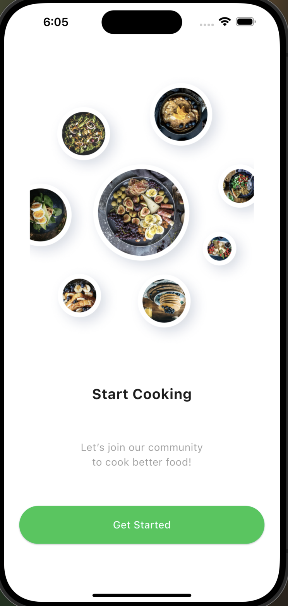
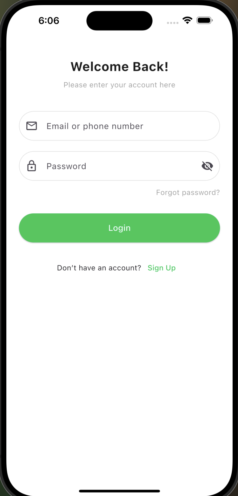
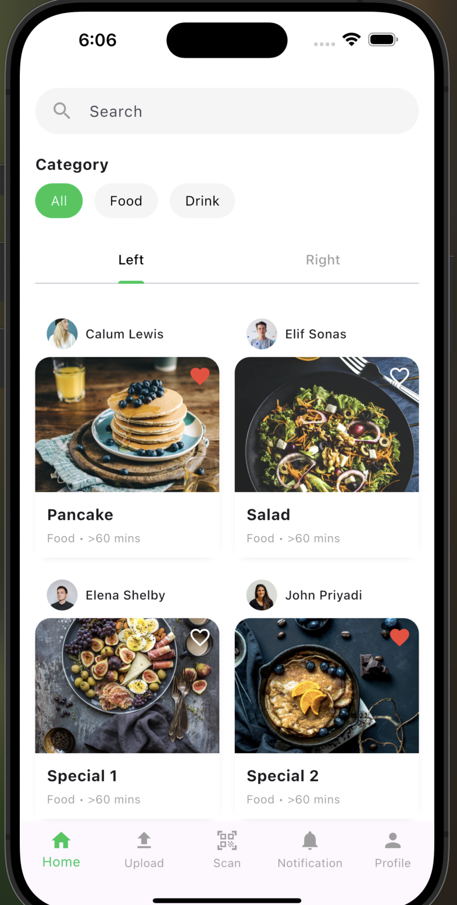
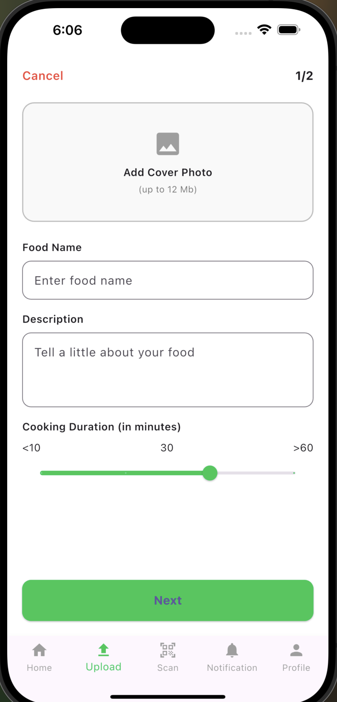
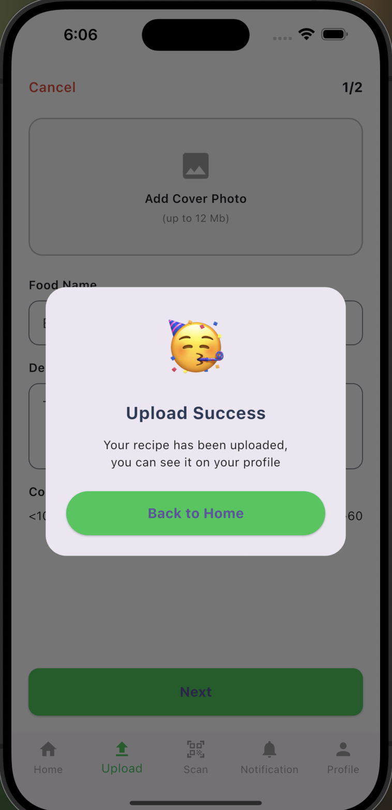
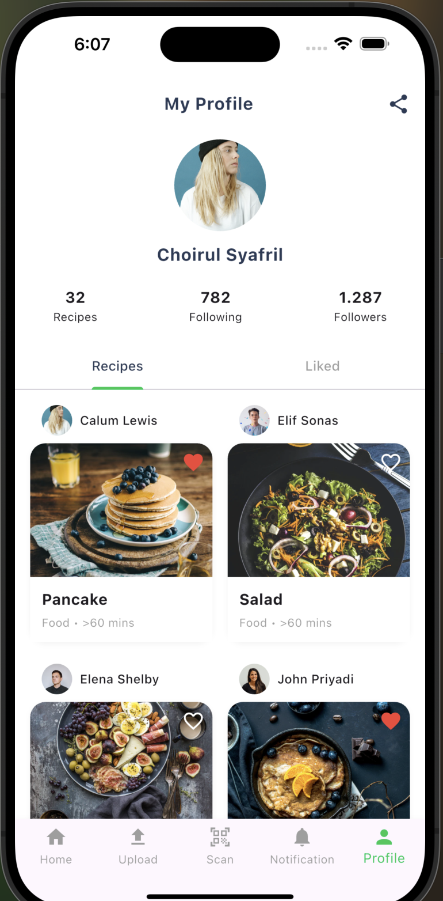

# Flutter Recipes App 🍽️

A Flutter app that lets users explore, like, and manage recipes — powered by BLoC for state management.

---

## 🔹 What’s in the app:

- 🔐 Login & Sign up  
- 🏠 Home screen with recipes  
- ❤️ Like & Unlike functionality  
- ⭐ Liked recipes tab  
- 👤 Profile with user stats & tabs  
- 📱 Full UI based on Figma design  

---

## 🖼️ Screenshots

| Onboarding | Login | Signup |
|:--:|:--:|:--:|
|  |  |  |

| Home | Upload | Upload Dialog |
|:--:|:--:|:--:|
|  |  |  |

| Profile |
|:--:|
|  |
=======


## 🚀 How to Run

1. Clone the repo:
   ```bash
   git clone https://github.com/Ameerah077/recipes_app.git
2. Navigate to the project folder:
cd recipes_app
3. Get dependencies:
flutter pub get
4. Run the app:
flutter run

--- 

## 👩‍🎓 Author
Ameerah  Aloufi
